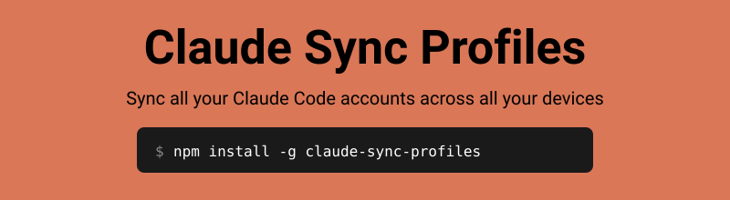

<div align="center">

# claude-sync-profiles



<br>

*Encrypted with [age](https://github.com/FiloSottile/age) • R2 / S3 / GCS / WebDAV supported • Multi-account profiles*

[](https://github.com/leog/claude-sync-profiles/releases)
[](LICENSE)
[](https://www.npmjs.com/package/claude-sync-profiles)

[Quick Start](#quick-start) • [Multiple Accounts](#multiple-claude-accounts-profiles) • [Setup Guide](#setup-guide) • [Commands](#commands) • [Security](#security)

</div>

---

> **This is a fork.** `claude-sync-profiles` is a standalone fork of
> [tawanorg/claude-sync](https://github.com/tawanorg/claude-sync), which does all
> the heavy lifting of encrypted cross-device sync — full credit to its authors.
> This fork adds **multi-account support (profiles)**: sync several Claude
> config directories (e.g. `~/.claude` for work and `~/.claude-personal` for
> personal) independently from the same machine, to the same or different
> buckets. See [Multiple Claude accounts](#multiple-claude-accounts-profiles).

## Features

- **Cross-device sync**: Continue Claude Code conversations on any laptop
- **Multi-account profiles** *(this fork)*: sync `~/.claude` and `~/.claude-personal` (or any `CLAUDE_CONFIG_DIR`) side by side, each with its own storage config, encryption key, and sync state
- **Shared-bucket namespacing** *(this fork)*: an optional remote key prefix lets several profiles share a single bucket without colliding
- **Multi-provider storage**: Cloudflare R2, AWS S3, Google Cloud Storage, S3-compatible (Backblaze B2, MinIO, Wasabi), or WebDAV (Nextcloud, ownCloud)
- **End-to-end encryption**: All files encrypted with age before upload
- **Passphrase-based keys**: Same passphrase = same key on any device (no file copying)
- **Selective sync**: Choose `--scope sessions` to sync only conversation data (skip plugins/node_modules)
- **Interactive wizard**: Arrow-key driven setup with validation
- **Secure self-updating**: `claude-sync update` downloads and verifies SHA256 checksums
- **Simple CLI**: `push`, `pull`, `status`, `diff`, `conflicts`, `profiles` commands
- **Compression**: Gzip compression before encryption for faster syncs
- **Shell integration**: Optional shell hooks for automatic push/pull

<div align="center">

</div>

## Quick Start

### First Device

```bash
# Install
npm install -g claude-sync-profiles

# Set up (interactive wizard)
claude-sync init

# Push your sessions
claude-sync push
```

### Second Device

```bash
# Install
npm install -g claude-sync-profiles

# Set up with SAME storage credentials
claude-sync init
# Select same provider (R2/S3/GCS/WebDAV)
# Enter same bucket name and credentials
# Choose "Passphrase" for encryption
# Enter the SAME passphrase as first device
# ✓ Encryption key verified  <-- confirms passphrase matches!

# Preview what would be synced
claude-sync pull --dry-run

# Pull sessions (creates backup if you have existing files)
claude-sync pull
```

**Same passphrase = same encryption key.** The init verifies your passphrase can decrypt remote files before completing.

## Multiple Claude accounts (profiles)

If you run more than one Claude account on a machine — say **work** in the
default `~/.claude` and **personal** in `~/.claude-personal` (pointed at by
Claude Code's `CLAUDE_CONFIG_DIR`) — set up one *profile* per account. Each
profile has its own storage config, encryption key, sync state, and Claude
directory:

- **default profile** → `~/.claude-sync/`, syncs `~/.claude` (exactly the pre-fork behavior)
- **named profile `<name>`** → `~/.claude-sync/profiles/<name>/`, syncs whatever `claude_dir` you configure

### Set up

```bash
# Work account: default profile, syncs ~/.claude
claude-sync init

# Personal account: its own profile, syncs ~/.claude-personal
claude-sync --profile personal init --claude-dir ~/.claude-personal
```

During a named profile's init you'll also be asked for a **remote key prefix**
(default: the profile name). The prefix namespaces the profile's files inside
the bucket, so both accounts can share **one bucket** without colliding — or
point each profile at a different bucket and leave the prefix empty. Use the
same prefix for the same profile on every device.

### Daily use

```bash
claude-sync push                        # default (work) profile
claude-sync --profile personal push     # personal profile
claude-sync push --all-profiles         # every configured profile in one go
claude-sync pull --all-profiles

claude-sync profiles                    # list profiles, dirs, and remotes
export CLAUDE_SYNC_PROFILE=personal     # or select via environment variable
```

### On your other computer

Run the same two `init` commands with the same buckets/prefixes and the same
passphrases, then `claude-sync pull --all-profiles`. Sessions resume on the
other machine as long as project paths match relative to home (see
[Cross-Device Path Mapping](#cross-device-path-mapping) when they don't).

### Transparent sync via Claude Code hooks

`claude-sync auto enable` installs Claude Code hooks so syncing happens
without you thinking about it: a `SessionStart` hook pulls when a session
begins, and a `Stop` hook pushes when a session finishes. The hooks are
profile-aware — with `--profile personal` they run
`claude-sync --profile personal pull/push -q` and are written into
`~/.claude-personal/settings.json`.

```bash
# Every project of the work account (default profile)
claude-sync auto enable

# Every project of the personal account
claude-sync --profile personal auto enable

# Only one specific project (writes <project>/.claude/settings.local.json)
claude-sync --profile personal auto enable --project ~/dev/side-project

# Check / remove
claude-sync auto status
claude-sync --profile personal auto disable --project ~/dev/side-project
```

`--project` writes the personal `.claude/settings.local.json` by default (it
stays out of git); add `--shared` to write the committed `.claude/settings.json`
so the whole team gets the hooks.

### Notes

- **MCP sync follows the profile**: for a custom `claude_dir`, MCP servers are
  read from `<claude_dir>/.claude.json` (matching `CLAUDE_CONFIG_DIR`
  semantics); the default profile keeps using `~/.claude.json`.
- **Config keys** (per profile, in its `config.yaml`): `claude_dir` selects the
  synced directory; `storage.prefix` sets the remote key prefix:

  ```yaml
  storage:
    provider: r2
    bucket: claude-sync
    prefix: personal        # namespace inside the shared bucket
    # ...credentials...
  claude_dir: ~/.claude-personal
  encryption_key_path: ~/.claude-sync/profiles/personal/age-key.txt
  ```

## Setup Guide

### Step 1: Choose a Storage Provider

| Provider | Free Tier | Best For |
|----------|-----------|----------|
| **Cloudflare R2** | 10GB storage | Personal use (recommended) |
| **AWS S3** | 5GB (12 months) | AWS users |
| **Google Cloud Storage** | 5GB | GCP users |
| **S3-compatible** | varies | Backblaze B2, MinIO, Wasabi, DigitalOcean Spaces, self-hosted |
| **WebDAV** | Self-hosted (unlimited) | Nextcloud/ownCloud users |

### Step 2: Create a Bucket

<details>
<summary><b>Cloudflare R2</b> (recommended)</summary>

1. Go to [Cloudflare Dashboard](https://dash.cloudflare.com/) → R2 Object Storage
2. Click "Create bucket" → name it `claude-sync`
3. Go to "Manage R2 API Tokens" → "Create API Token"
4. Select **Object Read & Write** permission → Create

You'll need: Account ID, Access Key ID, Secret Access Key
</details>

<details>
<summary><b>AWS S3</b></summary>

1. Go to [S3 Console](https://s3.console.aws.amazon.com/s3/bucket/create) → Create bucket
2. Go to [IAM Security Credentials](https://console.aws.amazon.com/iam/home#/security_credentials)
3. Create Access Keys

You'll need: Access Key ID, Secret Access Key, Region
</details>

<details>
<summary><b>Google Cloud Storage</b></summary>

1. Go to [Cloud Storage](https://console.cloud.google.com/storage/create-bucket) → Create bucket
2. Go to [Service Accounts](https://console.cloud.google.com/iam-admin/serviceaccounts) → Create service account
3. Grant "Storage Object Admin" role → Create JSON key

You'll need: Project ID, Service Account JSON file (or use `gcloud auth application-default login`)
</details>

<details>
<summary><b>S3-compatible</b> (Backblaze B2, MinIO, Wasabi, DigitalOcean Spaces, ...)</summary>

Any provider exposing an S3-compatible API works through the **S3-compatible (custom endpoint)** option. Create a bucket and an application key with your provider, then supply its S3 endpoint URL.

Example (Backblaze B2):

```bash
claude-sync init --provider s3-compatible --endpoint https://s3.us-west-004.backblazeb2.com
```

You'll need: Endpoint URL, Access Key ID, Secret Access Key, Bucket. The signing region is auto-detected from the endpoint (e.g. `us-west-004`); for providers that ignore it, `auto` is used.

For servers that don't resolve buckets as subdomains (e.g. Ceph RGW, or MinIO without wildcard DNS), add `--use-path-style` to address objects as `endpoint/bucket/key` instead of `bucket.endpoint/key`:

```bash
claude-sync init --provider s3-compatible --endpoint https://ceph.example.com --use-path-style
```

It's off by default and unnecessary for Backblaze B2, Wasabi, and DigitalOcean Spaces, which all support virtual-hosted addressing.

> Custom endpoints automatically relax the AWS SDK's default integrity-checksum headers, which some S3-compatible providers reject. AWS S3 behavior is unchanged.
</details>

<details>
<summary><b>WebDAV (Nextcloud, ownCloud, etc.)</b></summary>

No bucket to create — just point at your existing WebDAV server.

1. **Nextcloud**: Go to Settings → Security → Devices & sessions → Create app password
2. Note your WebDAV URL: `https://your-server/remote.php/dav/files/USERNAME/`

You'll need: WebDAV URL, Username, App password

The wizard will create a `claude-sync` subdirectory automatically.
</details>

### Step 3: Run Init

```bash
claude-sync init
```

The interactive wizard will guide you through:

1. **Select storage provider** (R2, S3, GCS, or WebDAV)
2. **Enter credentials** (provider-specific)
3. **Choose encryption method**:
   - **Passphrase** (recommended) - same passphrase on all devices = same key
   - **Random key** - must copy `~/.claude-sync/age-key.txt` to other devices
4. **Test the connection** to verify everything works

### Step 4: Push and Pull

```bash
# Upload local changes
claude-sync push

# Download remote changes
claude-sync pull
```

## What Gets Synced

| Path | Content |
|------|---------|
| `~/.claude/projects/` | Session files, auto-memory |
| `~/.claude/plans/` | Implementation plans from plan mode |
| `~/.claude/tasks/` | Task tracking state |
| `~/.claude/history.jsonl` | Command history |
| `~/.claude/agents/` | Custom agents |
| `~/.claude/skills/` | Custom skills |
| `~/.claude/plugins/` | Plugins |
| `~/.claude/rules/` | Custom rules |
| `~/.claude/settings.json` | Settings |
| `~/.claude/settings.local.json` | Local settings |
| `~/.claude/CLAUDE.md` | Global instructions |

### Sync scope

`init` asks whether to sync everything or just conversation data; you can also set it with `--scope`:

| Scope | Syncs | Use when |
|-------|-------|----------|
| `full` (default) | everything in the table above | you want settings, skills, agents, and plugins mirrored too |
| `sessions` | `projects/`, `history.jsonl`, `tasks/`, `plans/` only | you just want `claude --resume` to work across machines |

```bash
claude-sync init --scope sessions
```

**Why `sessions` exists:** `full` includes `plugins/`, whose plugin caches bundle `node_modules` and Python `.venv` trees — thousands of large, machine-/arch-specific files that are regenerated on demand and should not be synced. `sessions` skips them, keeping syncs small, fast, and portable. The scope is saved in `~/.claude-sync/config.yaml` and applies to every `push`/`pull`.

## Cross-Device Path Mapping

Claude Code indexes project sessions by **absolute filesystem path**:

```
/Users/alice/my-app → ~/.claude/projects/-Users-alice-my-app/
/Users/bob/my-app   → ~/.claude/projects/-Users-bob-my-app/
```

Synced verbatim, those would be **different projects** and `claude --resume` on the second machine would never find the first machine's sessions. claude-sync solves this by translating paths during sync:

- **Home directories are mapped automatically.** Sessions are stored remotely under a portable `${HOME}` token (in both remote keys and transcript content), then rewritten to each device's real home on pull. Different usernames across machines just work.
- **Other layout differences are configurable.** If one machine keeps projects in `~/work` and another in `~/Projects`, point both at the same token in `~/.claude-sync/config.yaml`:

  ```yaml
  # machine 1
  path_map:
    ~/work: WORK
  ```

  ```yaml
  # machine 2
  path_map:
    ~/Projects: WORK
  ```

  Sessions under either directory sync to the shared `${WORK}` namespace and resume correctly on both machines.

**Upgrading from an older version?** Run `claude-sync migrate` once on each device to convert existing remote data to portable keys. Paths the current device doesn't own are left for the other device's migrate run.

## Commands

```bash
claude-sync init        # Set up configuration (interactive wizard)
claude-sync push        # Upload local changes to cloud storage
claude-sync pull        # Download remote changes from cloud storage
claude-sync status      # Show pending local changes
claude-sync diff        # Show differences between local and remote
claude-sync conflicts   # List and resolve conflicts
claude-sync profiles    # List sync profiles (multi-account)
claude-sync rebuild-history  # Rebuild ~/.claude/history.jsonl from session files
claude-sync reset       # Reset configuration (forgot passphrase)
claude-sync migrate     # Convert legacy remote keys to portable path-mapped keys
claude-sync update      # Update to latest version (verifies release checksums)
claude-sync changelog   # Show release history
claude-sync --help      # Show all commands
```

Every command accepts `--profile <name>` (or `$CLAUDE_SYNC_PROFILE`) to operate
on a named profile; `push` and `pull` also accept `--all-profiles`. See
[Multiple Claude accounts](#multiple-claude-accounts-profiles).

### Pull Options

```bash
claude-sync pull                    # Normal pull (prompts if existing files)
claude-sync pull --dry-run          # Preview what would change
claude-sync pull --force            # Skip confirmation prompts
claude-sync pull --rebuild-history  # Also rebuild history.jsonl after pulling
```

### Rebuilding Prompt History

`history.jsonl` is synced as a single file, so pushes from two devices are
last-writer-wins and one device's prompt-history entries can be lost — which
breaks the `/resume` session picker. Session files sync cleanly (one file per
session), so the history can always be reconstructed from them:

```bash
claude-sync rebuild-history         # One-off rebuild
claude-sync pull --rebuild-history  # Rebuild automatically after a pull
```

Every existing entry is preserved, recovered prompts are merged in and sorted by
timestamp, and the previous file is kept as `history.jsonl.bak`.

### Init Options

```bash
claude-sync init              # Full setup wizard
claude-sync init --passphrase # Re-enter passphrase only (keeps storage config)
claude-sync init --force      # Reset everything, start fresh

# Multi-account (see "Multiple Claude accounts" above)
claude-sync --profile personal init --claude-dir ~/.claude-personal
claude-sync --profile personal init --claude-dir ~/.claude-personal --remote-prefix personal
```

### Quiet Mode

```bash
claude-sync push -q     # No output (for scripts)
claude-sync pull -q
```

### Check for Updates

```bash
claude-sync update --check   # Check without installing
claude-sync update           # Download and install latest version
```

### Changelog

```bash
claude-sync changelog            # Show recent releases
claude-sync changelog --limit 5  # Show last 5 releases
```

## Exclude Patterns

Skip specific files or directories during sync by adding exclude patterns to your config (`~/.claude-sync/config.yaml`):

```yaml
exclude:
  - "*.tmp"
  - "projects/*/node_modules/*"
  - "projects/*/.git/*"
```

Patterns use glob syntax and are matched against paths relative to `~/.claude`.

## Shell Integration

Add to `~/.zshrc` or `~/.bashrc`:

```bash
# Auto-pull on shell start
if command -v claude-sync &> /dev/null; then
  # Run in a subshell so the job is detached from the parent shell's
  # job table — avoids interactive `[1] 12345` / `[1] + done` noise.
  (claude-sync pull -q &) >/dev/null 2>&1
fi

# Auto-push on shell exit
trap 'claude-sync push -q' EXIT
```

> **Note:** The subshell wrapper `(cmd &)` prevents zsh/bash from printing job control
> messages (`[1] 12345` on start and `[1] + done cmd` on completion) every time you open
> a terminal. A plain `claude-sync pull -q &` works but produces noisy shell prompts.

## Pulling with Existing Files

When you pull on a device that already has `~/.claude` files, claude-sync will:

1. **Show what would change** - files that would be overwritten, kept, or downloaded
2. **Ask for confirmation** - choose to backup, overwrite, or abort
3. **Create a backup** - saves existing files to `~/.claude.backup.{timestamp}`

```bash
# Preview first
claude-sync pull --dry-run

# Pull with prompts
claude-sync pull

# Skip prompts (for scripts)
claude-sync pull --force
```

## Conflict Resolution

When both local and remote files change, the remote version is saved as `.conflict`:

```bash
claude-sync conflicts            # Interactive resolution
claude-sync conflicts --list     # Just list conflicts
claude-sync conflicts --keep local   # Keep all local versions
claude-sync conflicts --keep remote  # Keep all remote versions
```

Interactive options:
- **[l]** Keep local (delete conflict file)
- **[r]** Keep remote (replace local)
- **[d]** Show diff
- **[s]** Skip
- **[q]** Quit

## Wrong Passphrase?

If you entered the wrong passphrase on a new device:

```bash
# Re-enter passphrase (keeps your storage config)
claude-sync init --passphrase
```

The init will verify your passphrase can decrypt remote files before completing.

## Forgot Passphrase?

The passphrase is **never stored**. If you forget it:

1. Your encrypted files cannot be recovered
2. Reset and start fresh:

```bash
claude-sync reset --remote   # Delete remote files and local config
claude-sync init             # Set up again with new passphrase
claude-sync push             # Re-upload from this device
```

## Security

- Files compressed with gzip, then encrypted with [age](https://github.com/FiloSottile/age) before upload
- Passphrase-derived keys use Argon2 (memory-hard KDF)
- Passphrase is never stored - only the derived key at `~/.claude-sync/age-key.txt`
- Cloud storage is private (API key/IAM auth)
- Config files and downloads stored with 0600/0700 permissions (user-only)
- Self-update verifies SHA256 checksums before installing new binaries
- Backward compatible: can read both compressed and uncompressed remote files

## Cost

Claude sessions typically use < 50MB. Syncing is effectively **free** on any provider:

| Provider | Free Tier |
|----------|-----------|
| **Cloudflare R2** | 10GB storage, 1M writes, 10M reads/month |
| **AWS S3** | 5GB for 12 months (then ~$0.023/GB) |
| **Google Cloud Storage** | 5GB, 5K writes, 50K reads/month |
| **WebDAV** | Self-hosted — no limits, no cost beyond your own server |

## Installation Options

### npm (recommended)

**Prerequisite:** Node.js 14+ (no Go required - downloads pre-compiled binary)

```bash
# Global install
npm install -g claude-sync-profiles

# Or one-time use
npx claude-sync-profiles init
```

### GitHub Packages

**Prerequisite:** Node.js 14+

```bash
# Add to ~/.npmrc
echo "@leog:registry=https://npm.pkg.github.com" >> ~/.npmrc

# Install
npm install -g claude-sync-profiles
```

### Download Binary

**Prerequisite:** None

```bash
# macOS ARM (M1/M2/M3)
curl -L https://github.com/leog/claude-sync-profiles/releases/latest/download/claude-sync-darwin-arm64 -o claude-sync
chmod +x claude-sync
sudo mv claude-sync /usr/local/bin/
```

See [GitHub Releases](https://github.com/leog/claude-sync-profiles/releases) for all platforms.

### Go Install

**Prerequisite:** Go 1.21+ (for developers)

```bash
go install github.com/leog/claude-sync-profiles/cmd/claude-sync@latest
```

### Build from Source

**Prerequisite:** Go 1.21+

```bash
git clone https://github.com/leog/claude-sync-profiles
cd claude-sync-profiles
make build
./bin/claude-sync --version
```

## Development

```bash
make test          # Run tests
make fmt           # Format code
make check         # Run all pre-commit checks
make build-all     # Build for all platforms
make setup-hooks   # Enable git pre-commit hooks
```

## Credits

This project is a fork of [claude-sync](https://github.com/tawanorg/claude-sync)
by [@tawanorg](https://github.com/tawanorg). All of the core sync, encryption,
storage, and path-mapping machinery comes from that project; this fork adds
multi-account profile support and is maintained independently at
[leog/claude-sync-profiles](https://github.com/leog/claude-sync-profiles).

## License

MIT
